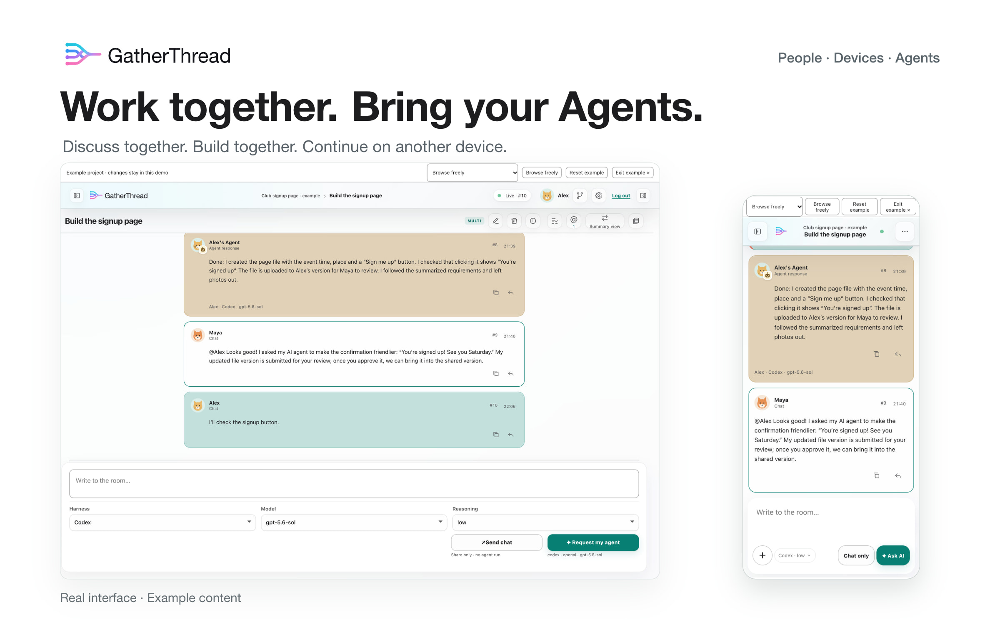
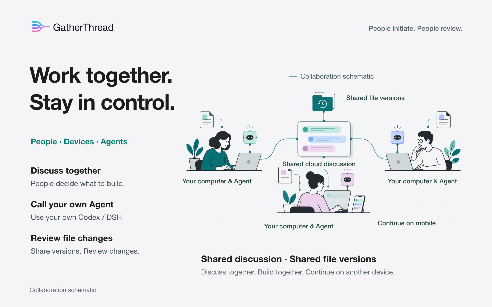
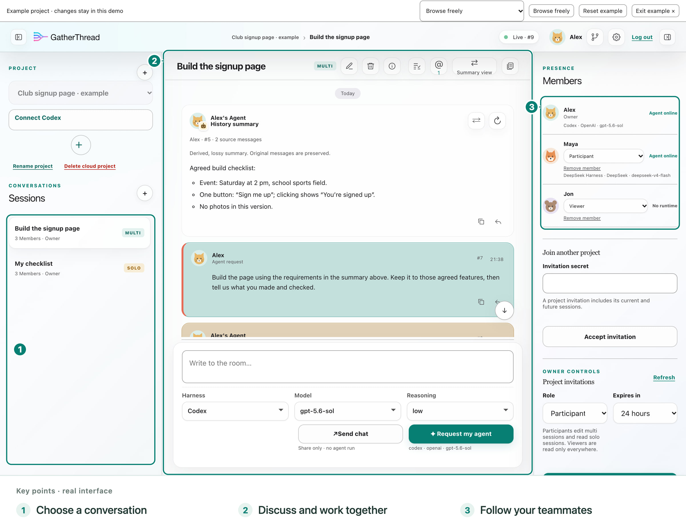
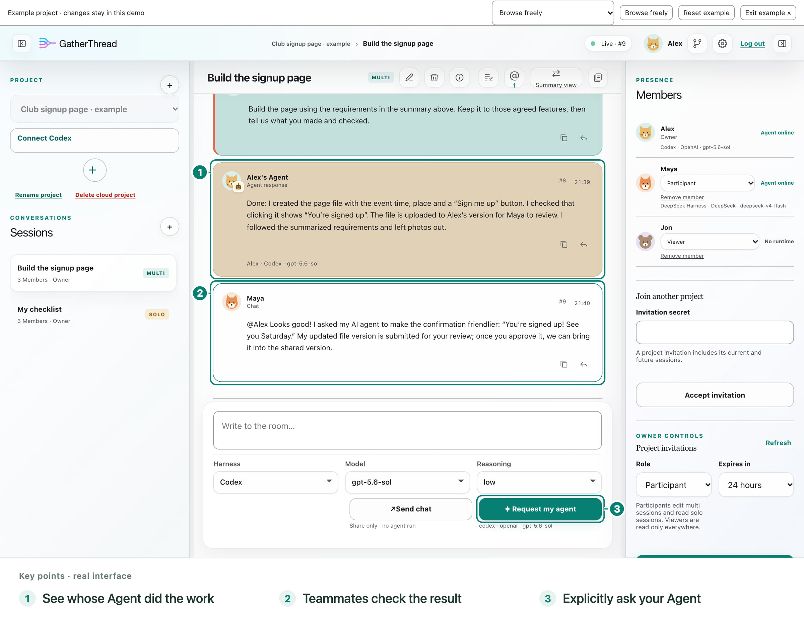
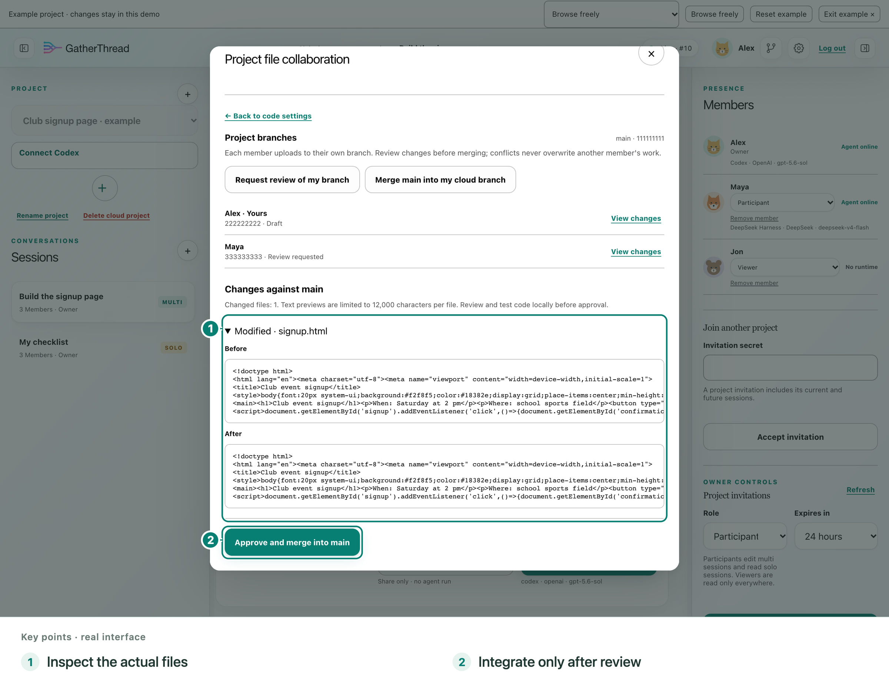
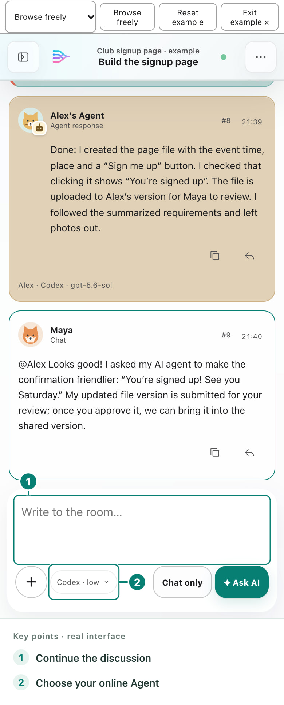

# GatherThread

**Work together. Bring your Agents. Keep going anywhere.**

GatherThread puts your team's discussion, AI-assisted work, and file review in one shared conversation. Collaborate live, use your own Agent, and continue from a computer, phone, or tablet. Less copying between chats. More progress everyone can follow.

[Open GatherThread](https://gatherthread.cn/) · [Try the example](https://gatherthread.cn/app/example.html?locale=en&topic=browse) · [Illustrated guide](docs/PRODUCT_GUIDE.md) · [简体中文](README.zh-CN.md)

Open source · Self-hostable · Current version identifier **0.1.0-alpha.8** · [Apache 2.0](LICENSE)

Preparing a publicly registrable Beta: verify your email and sign in with a password, without an account invitation or qualification code. Registration availability is shown on the sign-in page; project invitations are separate.

## Your team. Your devices. Your Agents.

**Work together in the same conversation.** Agree on a goal, ask your Agent to work, and let teammates follow the result. Quote a particular message or mention someone instead of explaining the same thing twice. Discussion and development stay together.

**Keep going beyond your desk.** The same account can be signed in on computers, phones, and tablets at once. On your phone, continue the discussion, review progress, or ask your connected computer Agent to keep working. Move to another computer by downloading the file version you saved.

**Choose the helper that fits.** Connect Codex or DeepSeek Harness, or use the cloud trial Agent for a small task without local setup. Choose from that Agent's supported models and options. Each teammate keeps their own setup while sharing discussion and results; cloud usage allowances are shown in the workspace.

A phone or tablet can request your computer Agent from another network. Keep that computer and its connector online, and use a GatherThread server the mobile device can reach. You do not install a local Agent on the phone.

## One project, from discussion to delivery

These are full application screenshots with key controls annotated, from the disposable example. People, messages, and Agent replies are demonstration content.

### 1. Agree on what to make

Maya wants a club signup page. Alex confirms the time, place, and button behavior. Both see the same discussion. Sending **Chat** talks to people; it does not start an Agent.

### 2. Turn decisions into work

Choose or connect your Agent, then explicitly ask it to build. Everyone can follow the public progress and answer. If the discussion is long, first summarize the selected requirements; the original messages remain available.

### 3. Check the changes before combining them

Each member uploads to their own branch. In the GT Cloud example, Maya submits a friendlier confirmation message for Alex to review. On GitHub, use the repository's pull-request review. Automatic upload does not mean automatic merge.

### 4. Continue on another device

Open the same conversation on your phone or tablet. Catch up, discuss the next step, or request your own online computer Agent without returning to your desk.

Follow the complete story, including the working signup page, in the [illustrated product guide](docs/PRODUCT_GUIDE.md).

## Project files: GitHub for real development

**Choose GitHub for ongoing development.** Each member authorizes their local connection and uploads to a personal branch. For this local sync path, files go directly from the computer to GitHub and do not count against GatherThread cloud file quotas. Automatic upload waits for Agent work to stop and files to settle; manual upload, download, and recovery are also available. Review and integrate through GitHub.

**Choose GT Cloud for a lightweight trial.** Try a small project with GatherThread's file service: 128 MiB of current file versions per user, without first setting up GitHub. Inspect member versions, submit changes for review, let the project owner integrate them, and recover uploaded files.

The destinations are independent: connecting one does not move the other's files. File sharing needs separate authorization, and its upload switch is separate from conversation uploads. Neither path automatically downloads or merges. Use separate local folders for people or tools editing at the same time; personal branches do not isolate a shared local folder.

GitHub's permissions, platform rules, and local transfer safeguards still apply. Leaving a GatherThread project does not revoke GitHub access. These features save project source files, not a complete backup of your computer. See [file setup, limits, and recovery](docs/CODE_SYNC.md).

## Get started

1. **Sign in with a verified email address and password.** New here? Verify your email, choose a password, then create a project and a Multi conversation. Invite your teammates, or accept an existing project's invitation.
2. **Choose your Agent.** Try the [cloud Agent](docs/HOSTED_AGENT_GUIDE.md) without installing anything, or connect your computer with the [Codex launcher](docs/CODEX_CONNECT.md) or [DeepSeek Harness plugin](docs/DSH_CONNECT.md). A phone can use the cloud Agent directly, or that same account's connected computer Agent while the computer and connector stay online.
3. **Talk, then ask for work.** Use Chat for discussion and the separate Agent request button for AI work. Select an available Agent and its supported model options before requesting it.
4. **Share files when you need to.** Prefer GitHub for development; choose GT Cloud for a small trial. Authorize file access separately.

Want to practice first? Open the [free example](https://gatherthread.cn/app/example.html?locale=en&topic=browse) or the visual guides in Settings. Example changes are disposable, use no model quota, and do not affect real projects.

## More ways to work together

| Capability | What you can do |
|---|---|
| Multi and Solo | Collaborate in Multi; write your own Solo while project members can still read it. Solo is not a private conversation. |
| Quotes and mentions | Reply to a specific chat or Agent answer; open the mentions inbox to find messages addressed to you. |
| Shared summaries | Ask your own connected computer Agent (Codex/DSH) to summarize selected messages, keep the originals and older versions, and summarize again. |
| Conversation synchronization | Send shared history to connected Agents; switch local-to-cloud automatic uploads on or off per conversation, or manually upload completed turns. |
| Codex history import | Create a new visible local task from shared history. Review it and archive the old task yourself; live history delivery remains independent. |
| Models and request controls | Choose supported models and reasoning levels. During a computer Agent request, the request button becomes Pause or Resume. |
| Cloud trial Agent | Try small tasks in an isolated workspace without local installation or your own API key; workspace usage allowances apply. |
| Members and invitations | Manage owner, participant, and viewer roles; leave another person's project or remove members after resolving shared files. |
| Accounts and devices | Sign in on multiple devices, revoke a device independently, change your profile, or review the impact before deleting your account. |
| Bilingual onboarding | Use Chinese or English and learn through visual guides tailored to computers, phones, and tablets. |
| Rich answers | Read Markdown, code, formulas, and expandable public work progress without leaving the conversation. |
| Self-hosting | Run the collaboration service on your own server. |

Summaries may omit details and use your Agent's quota. Later Agent requests default to the summarized history; Settings can select original history instead. Reading-view toggles are separate. Pause/Resume controls a GatherThread request, not an identical freeze and restart of a native Agent's internal reasoning.

**Choose what you share.** Shared discussion goes to GatherThread; files you authorize go to the selected file service. Sharing a conversation does not give teammates your local tool approvals or model credentials. Check files for secrets before uploading. Cloud deletion does not delete local Agent conversations or files. See [privacy](https://gatherthread.cn/privacy/) and [security](docs/SECURITY.md).

## Next: Agents working more directly together

Our direction is simple: let one person coordinate several Agents, let teammates' Agents collaborate directly, and let multiple cloud Agents work as a team. **These automatic team capabilities are future plans**, separate from today's shared conversations and individually requested Agents.

### Explore, contribute, or self-host

[Product guide](docs/PRODUCT_GUIDE.md) · [All documentation](docs/README.md) · [Codex setup](docs/CODEX_CONNECT.md) · [DSH setup](docs/DSH_CONNECT.md) · [File collaboration](docs/CODE_SYNC.md) · [Self-hosting](docs/SELF_HOSTING.md) · [Release notes](CHANGELOG.md)

Developers: start with [AGENTS.md](AGENTS.md) and [CONTRIBUTING.md](CONTRIBUTING.md), then the [architecture](docs/ARCHITECTURE.md) and [interface contracts](docs/INTERFACE_CONTRACTS.md). Use Node.js 24 or newer; see the hosting guide for local setup. The project lead reviews version updates before release.

[Report a bug or suggest an improvement](https://github.com/TH060419/gatherthread/issues). Report security issues privately to [coolhezi@sjtu.edu.cn](mailto:coolhezi@sjtu.edu.cn); never post credentials or private transcripts.

Licensed under [Apache 2.0](LICENSE). Copyright 2026 Yuhan He and contributors.
