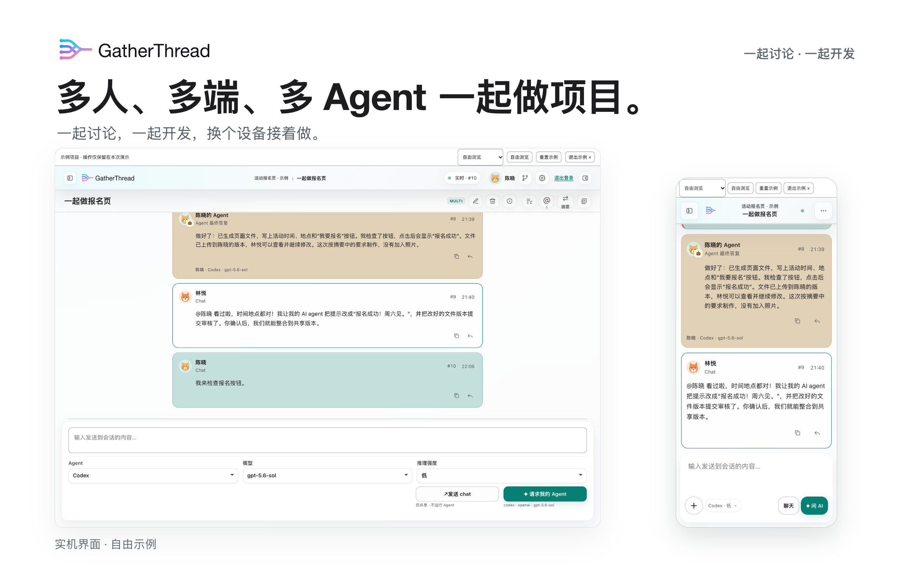

# GatherThread 共序

**多人、多端、多 Agent，一起做项目。**

让讨论和开发发生在同一个地方。GatherThread 把**多人联机、共享会话、各自的 AI Agent 和文件协作**放在一起：说清楚要做什么，请自己的 Agent 开始做，同伴一起看进展、检查成果。换到手机或平板，也能接着推进。

[开始使用](https://gatherthread.cn/app/) · [自由示例](https://gatherthread.cn/app/example.html?locale=zh-CN&topic=browse) · [图文指南](docs/PRODUCT_GUIDE.zh-CN.md) · [English](README.md)

开源 · 可自托管 · 当前版本标识 **0.1.0-alpha.8** · [Apache 2.0](LICENSE)

## 一起聊，一起做，换个设备接着来

**多人：让讨论直接推动开发。** 大家共用一段会话，聊天、引用、@同伴、AI 进展和回答都在一起。各自的 Agent 能参考共享讨论，少一点复制转发，多一点真正协作。

**多端：人离开电脑，项目不必停。** 同一账号可在电脑、手机、平板同时登录。路上回同伴、看进展、请电脑上的 Agent 继续做；换电脑时，也能下载已保存的文件版本接着工作。

**多 Agent：每个人用合适的帮手。** 带上熟悉的 Codex 或 DeepSeek Harness，也可直接选择云端体验 Agent 做小项目。各自选择自己的 Agent、模型和思考强度，团队共享讨论和成果。

## 看一个小项目怎么完成

以下实机图为应用内自由示例的完整界面，并配以重点标注；人物、讨论和 Agent 回答均为演示内容。

### 1. 先说清楚，再请 AI 做

林悦和陈晓约定：做一个社团报名页，显示时间、地点，点击按钮后提示报名成功。聊天不会启动 Agent；讨论较长时，可以先请自己已连接的电脑 Agent 把选中的消息整理成清单，原文仍可查看。

### 2. 各自调用，同伴跟进

陈晓明确请求自己的 Agent 制作页面。回复标明归属，公开工作进展和最终回答留在同一段会话里；林悦能接着检查，不必再去群聊索要结果。

### 3. 保存进度，看过改动再整合

林悦改善报名提示，把文件上传到自己的版本并提交审核。在这个 GT Cloud 示例中，项目创建者查看差异后决定是否合并。使用 GitHub 时，则走仓库的 PR 审核。自动上传帮忙保存进度，不替人做合并决定。

### 4. 换到手机，继续推进

不用在手机安装本地 Agent：调用同一账号已连接的电脑 Agent，或使用云端体验 Agent 即可。电脑 Agent 需保持电脑和连接器在线；手机不必靠近电脑，只需能访问服务器。

[看完整流程：讨论、引用/@、摘要、文件成果、手机和平板 →](docs/PRODUCT_GUIDE.zh-CN.md)

## 文件协作：实际开发优先 GitHub

| 选择 | 适合谁 | 怎样协作 |
|---|---|---|
| **GitHub，优先推荐** | 实际开发、长期项目 | 各自授权，上传到个人分支，文件直达 GitHub、不占 GT 文件额度；按仓库规则审核 PR。 |
| **GT Cloud，轻量体验** | 小项目、先体验协作 | 每用户 128 MiB 有效文件版本额度；在工作页查看分支和差异，由项目创建者审核合并。 |

支持手动上传、空闲时自动上传、下载更新和恢复到新目录。**不自动下载、不自动合并**；恢复只能找回已上传且符合规则的项目文件。文件传输需要授权且在线的电脑设备。

两种服务分别管理，不会自动搬迁已有文件。GitHub 仍有自身规则和本地传输安全限制；GT 项目权限不会替代 GitHub 仓库权限。个人分支不隔离本地目录，多人或多个工具同时改文件时，请各自使用独立目录。

[文件协作与恢复指南 →](docs/CODE_SYNC.md)

## 从这里开始

1. [注册并登录](https://gatherthread.cn/app/)，创建项目和一个 **Multi 多人会话**，邀请同伴；也可接受已有项目的邀请。
2. 选择云端体验 Agent，直接尝试小任务；或在电脑上连接自己的 Agent：[Codex 启动器](docs/CODEX_CONNECT.zh-CN.md)、[DSH 插件配对](docs/DSH_CONNECT.zh-CN.md)。
3. 与人交流用 **发送 chat**，请 AI 做事用 **请求我的 Agent**。例如：“做一个报名页，只要活动时间、地点和报名按钮。”
4. 需要分享文件时，再选择 GitHub 或 GT Cloud，检查目录并授权上传。

不确定先做什么？打开[自由示例](https://gatherthread.cn/app/example.html?locale=zh-CN&topic=browse)或设置中的新手引导。示例可以重置，不使用你的模型额度，也不改变真实项目。云端体验 Agent 适合额度内的小任务，已有电脑 Agent 也可随时选用。

## 核心能力，一处用起来

| 能力 | 你能做什么 |
|---|---|
| **多人和个人会话** | Multi 共同讨论；Solo 由本人操作，项目成员仍可阅读，不是私人聊天。 |
| **引用和 @定位** | 引用聊天、Agent 回复或摘要；从提及入口找到相关消息。 |
| **共享摘要** | 用自己已连接的 Codex/DSH 总结选中的历史，保留原文与版本，再次整理；默认让后续网页任务参考摘要，可在设置中改用原文。 |
| **本地与共享历史** | 共享消息传给已连接的 Agent；本地完成的回合可自动或手动上传，每条会话可独立关闭自动上传。 |
| **Codex 可见历史导入** | 初次连接可自动导入，也可随时手动建立新的本地任务；旧任务自行归档，实时历史传递不受影响。 |
| **Agent 请求控制** | 按所选 Agent 提供的能力换模型和思考强度，电脑 Agent 请求处理中可暂停、继续；不是冻结原生 Agent 的内部推理状态。 |
| **邀请与权限** | 创建者、参与者、访者分工；查看、发言、请求自己的 Agent 和文件操作按权限执行。 |
| **账号与设备** | 邮箱账号、多设备同时登录、独立撤销设备、退出项目和账号注销。 |
| **清晰阅读** | Markdown、代码、公式和可展开的工作过程；中英切换、手机和平板专属操作与引导。 |
| **自托管** | 在自己的服务器部署，管理协作数据和服务配置。 |

摘要有损，生成会使用所选 Agent 的额度；切换阅读视图不会自动更改后续任务的摘要设置。[图文指南](docs/PRODUCT_GUIDE.zh-CN.md)里有操作示例与说明。

## 共享由你选择

讨论与主动上传的本地回合进入 GatherThread；授权的文件进入所选文件服务。**文件上传、会话上传和设备授权分别管理**。本地模型凭据和工具批准权不会因为共享会话就交给同伴，但上传前仍请检查文件和消息中的秘密信息。

[隐私与删除说明](https://gatherthread.cn/privacy/) · [安全问题私下反馈](SECURITY.md)

## 下一步：让多个 Agent 更主动地合作

我们希望让一个人指挥多个 Agent 自动分工，让不同成员的 Agent 直接合作，并接入多个云端 Agent 组成团队。**这些自动团队能力是未来规划**；现在的特色是多人共享讨论、各自调用 Agent、共同检查和整合成果。

## 参与项目

欢迎[反馈体验或缺陷](https://github.com/TH060419/gatherthread/issues)，也欢迎贡献。请勿在公开 Issue 发布密码、邮箱验证码、设备凭据或私有代码。版本 PR 由项目负责人审核后发布。

[贡献规范](CONTRIBUTING.md) · [AI 开发规范](AGENTS.md) · [文档目录](docs/README.md) · [自托管](docs/SELF_HOSTING.md) · [接口与架构](docs/INTERFACE_CONTRACTS.md) · [更新记录](CHANGELOG.md) · [版本记录](docs/releases/README.md)
